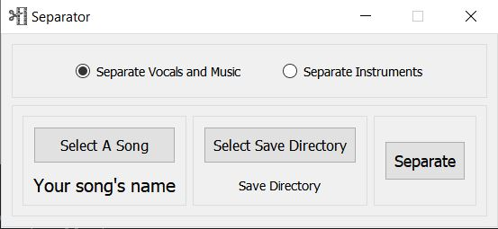
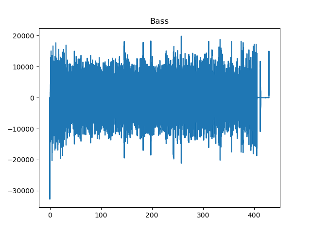
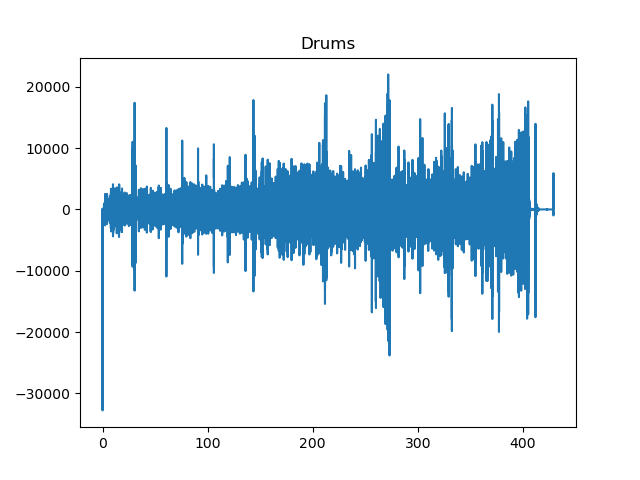
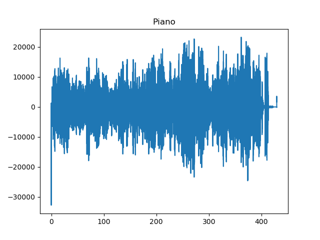

## Blind Source Seaparation

#### UI

##### NOTE: we couldn't upload the pretrained_models of spleeter to the repository as they were large (over 100MB). However, when using the application, it will notice that you don't have them in your working directory and will install them, so the first time using may take longer time.
##### NOTE: the songs and their separations are uploaded on google drive [here]()

##### Steps
1. Upload a song from 'Select A Song' button.
2. Upload the directory you want to save the separated wav files from 'Select Save Directory'.
3. Click 'Separate' to start the separation process.
4. When the spearation is done successfuly, a message will pop to inform you that.

* We used the spleeter package from Deezer to separate the audio files into different components. spleeter uses ICA and deep learning models in the separation models.

#### Separation of Songs into Vocals and Music
We use the spleeter 2stems model to separate the song into music and vocals.

#### Separation of Instruments
We use the spleeter 5stems model to separate the audio into 5 instruments. The idea of ICA is to provide a number of channels equall to the number of sources to sepearted with specific modulation of the sound. We found that the spleeter internally takes one source (the mp3 file uploaded) and create pseudo channels using the pretrained_models. This mode separates a musical file of differenet instruments; bass, piano, drums, other instruments in combined file, and if vocals found in the audio, it's spearated in vocals.wav file.
Using 'Songs/Fly Me To The Moon -- Beggie Adiar Trio.mp3', we found these results

 

 

We could conclude that's there's no vocals (people) singing in this file (could be found also when playing vocals.wav) and the drums, piano and bass are being played in this file with bigeer effect of the bass and piano.

#### Results
The results of separation using the UI can be found in 'SeparationResults' folder and songs used in 'Songs' and Instruments file in 'Instruments'